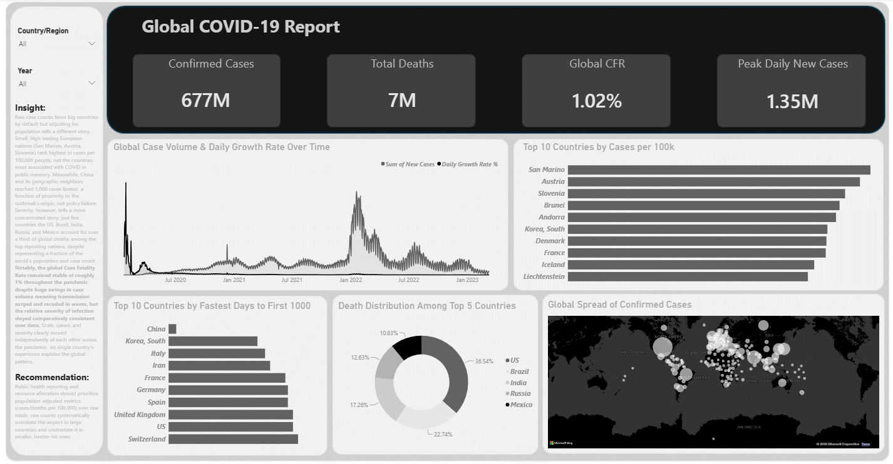

# The Uneven Pandemic: Scale & Speed
### A Population-Adjusted Power BI Dashboard on Global COVID-19 Spread

**AnalystLab Africa — Data Analytics Internship, Week 4 (Data Visualization & Dashboarding)**

---

## 📌 Project Overview

Most COVID-19 dashboards rank countries by raw case counts which quietly rewards large populations rather than actual outbreak severity. This project asks a sharper question:

> **Adjusted for population, which countries were truly hit hardest and how fast did their outbreaks escalate?**

The result is a single-page, fully interactive Power BI dashboard that layers scale, speed, and severity into one coherent story, backed by a properly modeled star-schema data foundation.

---

## 🖼️ Dashboard Preview

---

## 🗂️ Data Sources

| Source | Purpose | Link |
|---|---|---|
| **Johns Hopkins CSSE COVID-19 Time Series** | Daily cumulative confirmed cases & deaths, ~200 countries, Jan 2020 – Mar 2023 | [github.com/CSSEGISandData/COVID-19](https://github.com/CSSEGISandData/COVID-19) |
| **World Bank — Population, Total (SP.POP.TOTL)** | Country population figures (2021 reference year), used to calculate per-capita metrics | [data.worldbank.org/indicator/SP.POP.TOTL](https://data.worldbank.org/indicator/SP.POP.TOTL) |

**Why a second data source?** The JHU dataset alone can't answer "who was hit hardest relative to size" raw totals structurally favor large countries. Bringing in population data was a deliberate choice to move the analysis beyond what a generic dashboard would show.

**A known, documented gap:** JHU's recovered-cases file was excluded. JHU discontinued updating it in August 2021, and country-level reporting was inconsistent even before that. Instead, **Case Fatality Rate (CFR)** was used as a more reliable indicator of severity over time.

---

## 🧹 Data Cleaning & Modeling

All cleaning and modeling was done in **Power Query** and the **Power BI data model**:

- Unpivoted both JHU files from wide (date-per-column) to long format
- Fixed locale-based date parsing (JHU's `M/D/YY` format required explicit US-locale conversion to avoid silent parsing errors)
- **Aggregated province/state-level rows up to country level** — several countries (Canada, Australia, China, UK) report sub-national rows, which initially broke day-over-day calculations until corrected
- Merged in World Bank population data; resolved ~25 country-naming mismatches between sources (e.g., `US` vs. `United States`, `Congo (Kinshasa)` vs. `Congo, Dem. Rep.`) via manual value mapping
- Verified zero nulls and zero duplicate rows in core fields before modeling
- Built a dedicated **Date dimension table** (`CALENDAR()`-based, marked as an official date table) with Year/Quarter/Month/MonthName columns, related to the fact table in a proper one-to-many relationship required for reliable time-intelligence DAX

**Final model:** one fact table (`COVID_Master`: Country, Date, Confirmed, Deaths, Population) + one date dimension table (`DateTable`), connected in a clean star schema.

---

## 📊 KPIs & DAX Measures

| KPI | What it measures |
|---|---|
| **Total Confirmed / Total Deaths** | Global cumulative totals as of the latest reporting date |
| **Global CFR** | Case Fatality Rate Deaths ÷ Confirmed |
| **Cases per 100k** | Confirmed cases normalized by population the core "fair comparison" metric |
| **Peak Daily New Cases (+ per 100k)** | Each country's single worst reporting day, absolute and population-adjusted |
| **Days to First 1,000 Cases** | How quickly each country's outbreak reached four figures |
| **Days From Outbreak to Peak** | Days between crossing 1,000 cases and hitting peak daily cases a proxy for response speed |
| **Daily Growth Rate %** | Day-over-day % change in cumulative cases momentum, not just volume |

All measures were written and validated in DAX, including fixing two real bugs along the way (see **Challenges** below).

---

## 📈 Dashboard Features

- **KPI Cards** — Confirmed Cases, Total Deaths, Global CFR, Peak Daily New Cases
- **Geographic Map** — bubble-sized by confirmed cases, auto-geocoded by country name
- **Bar Chart** — Top 10 countries by Cases per 100k (the population-adjusted "hit hardest" ranking)
- **Bar Chart** — Top 10 fastest countries to reach 1,000 cases
- **Dual-Axis Line Chart** — Global daily new cases (volume) overlaid with daily growth rate % (momentum)
- **Donut Chart** — Death distribution among the top 5 reporting countries
- **Slicers** — Country/Region and Year, for full interactivity
- **Insight & Recommendation text** — data storytelling embedded directly in the dashboard, not left implicit

---

## 🔍 Key Insights

1. **Population context reverses the story.** Adjusted per 100,000 people, small high-testing European nations (San Marino, Austria, Slovenia) rank highest not the countries most associated with COVID in public memory.
2. **Speed reflects geography, not policy.** China and its neighbors reached 1,000 cases fastest, a function of proximity to the outbreak's origin rather than weak response.
3. **Severity is concentrated, not distributed.** Just five countries  US, Brazil, India, Russia, Mexico account for over a third of deaths among top-reporting nations, despite representing a fraction of global population and case count.
4. **CFR stayed stable while case volume swung wildly.** Global CFR held near 1% throughout, even across multiple dramatic waves in case volume severity per infection stayed consistent even as transmission didn't.

**Recommendation:** Public health reporting and resource allocation should prioritize population-adjusted metrics over raw totals  raw counts systematically overstate impact in large countries and understate it in smaller, harder-hit ones.

---

## 🐛 Challenges Faced (and Fixed)

Real, specific debugging not generic "data was messy" filler:

- **Locale-based date parsing errors** — JHU's `M/D/YY` dates initially threw errors under default locale settings; fixed by explicitly forcing US locale during type conversion in Power Query.
- **Province-level rows breaking daily calculations** — countries split into sub-national rows (Canada, Australia, etc.) caused a "New Cases" formula to compare mismatched totals, producing an impossible 100M+ single-day case count. Fixed by aggregating to one row per country/date **before** calculating daily deltas.
- **DAX context transition bug** - a "Days From Outbreak to Peak" measure returned negative values because `CALCULATE()` nested inside `FILTER()` silently collapsed filter context to a single row. Fixed using `ALLEXCEPT()` to correctly scope the calculation per country.
- **Cross-source country name mismatches** — resolved ~25 naming inconsistencies between JHU and World Bank data through manual value replacement in Power Query.

Every one of these was caught through validation against real-world figures not assumed correct on first build.

---

## 🛠️ Tools Used

`Power BI Desktop` · `Power Query` · `DAX` · `Johns Hopkins CSSE Data` · `World Bank Open Data`

---

## 📁 Files in This Folder

| File | Description |
|---|---|
| `COVID_Master.pbix` | Full interactive Power BI report |
| `Week4_COVID_Dashboard_Presentation.pptx` | 10-slide presentation summarizing the project |
| `dashboard-screenshot.png` | Static preview of the dashboard |

---

*Part of the AnalystLab Africa Data Analytics Internship Program — Week 4: Data Visualization & Dashboarding*
